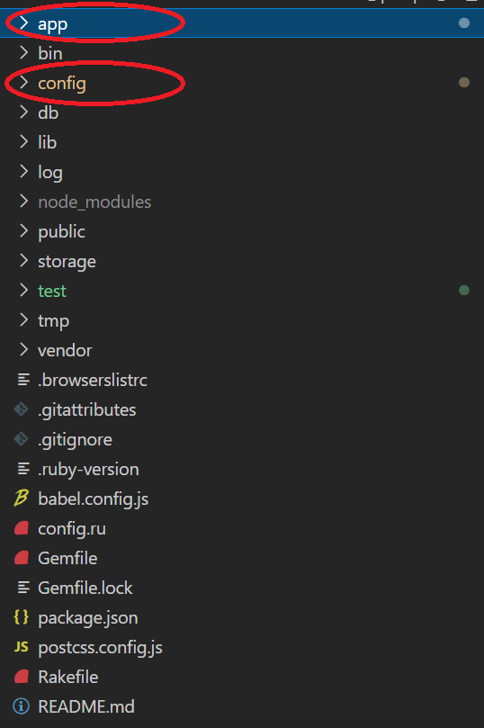
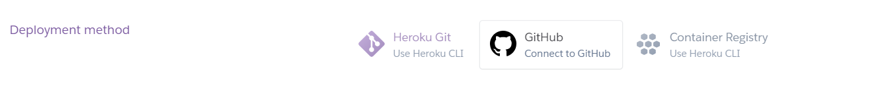
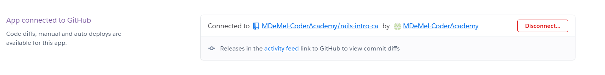

# Rails Introduction 

<h3> Welcome to your Rails Introduction... </h3></br>

This session intends to provide context for new developers in hopes that they would able to better utilize and understand the learning material available to them in their ' Ruby on Rails ' journey. </br>
All subsequent sessions will introduce concepts in a more formal and conventional manner.
</br></br>

Now, let's take a ' Whirlwind tour of Rails ' by creating a basic website and thereby answering some of the prime questions one might be compelled to ask.

First Fork and clone this repo in order to follow along with the following session material.


  - [1. What is Rails ?](#1-what-is-rails-)
  - [2. What is the Rails MVC Architecture ?](#2-what-is-the-rails-mvc-architecture-)
  - [3. Where do I start ? (create a new rails app)](#3-where-do-i-start--create-a-new-rails-app)
  - [4. Add a homepage.](#4-add-a-homepage)
  - [4. Add more webpages to your site.](#4-add-more-webpages-to-your-site)
  - [5. Linking the pages together.](#5-linking-the-pages-together)
  - [6. Styling our pages.](#6-styling-our-pages)
  - [6. using .erb files and features](#6-using-erb-files-and-features)
  - [7. making data and information available to our Views using Controllers.](#7-making-data-and-information-available-to-our-views-using-controllers)
  - [8. Receiving user input.](#8-receiving-user-input)
  - [9. Extensions and Further Study](#9-extensions-and-further-study)
  - [10. Deploying Website to Heroku](#10-deploying-website-to-heroku)

## 1. What is Rails ?
Rails is both an application and a framework. It is a Ruby application that generates files and installs the dependencies needed to create a functioning website.</br>
The way these files are structured along with the conventions and mechanisms that allow all of these programs to work together is collectively called a framework and hence, The Rails Framework.

## 2. What is the Rails MVC Architecture ?
Rails applications adhere to MVC Architectural patterns. You will meet this concept called MVC many times over the course of your career as a rails developer. </br>
MVC is a concept based on the principle of separation of concerns with the main intention of separating programme logic into 3 main components.
- The <u>Model</u> which should handle data related logic
- The <u>View</u> handles the presentation of information and data
- The <u>Controller</u> works as an intemediary between the model and view while controlling requests

Once a web request is sent by a user to the server -> the request will be handled by the Controller and then if needed the controller level programs will speak to the programs in the Models component to get the needed data and finally pass the needed information to the programs in the View component which will render an appropriate HTTP response back to the user.

## 3. Where do I start ? (create a new rails app)
we start by creating a new Rails application.
- Open terminal in a directory of your choice
- type in the following rails command

```bash
rails new app-name
```
This will create a website for you in it's most primary form. </br>Your Rails website contains many files and folders. It may be intimidating at first, but the best way to overcome this fear is through programming exercises akin to this session. You will gain more familiarity the more you practice.</br></br>
The two folders circled below are the only folders we will be using through out this session.


</br> you can refer to this [link](https://www.freecodecamp.org/news/what-happens-when-you-run-rails-new/) if you wish for more reference as to the purpose of all these files.

## 4. Add a homepage.

The rails router recognizes URLs defined in the 'routes.rb' file located in the config folder and dispatches them to a controller's action. 

- Define a route for your homepage using the ' root ' keyword. ( where 'homes' is the controller while 'index' is the action)

```ruby
root 'homes#index'
```

- Create a controller to handle the route you just defined in the ' controllers ' folder inside the app directory. 
</br>( the controller can be named :    controllername_controller.rb - in our case : homes_controller.rb)

```ruby
class HomesController < ApplicationController
end
```
<u>By default, controllers in Rails automatically render views with names that correspond to valid routes.</u>

Hence it is not necessary to define the specific action unless it is needed to accomplish a task.
Depending on the action defined in your route, rails will try to render a view template as the same name as your action under a folder with the same name as your controller.

- Create a folder named 'homes' in the 'views' directory
- create a view template 'index.html.erb' in the 'homes' folder

The .erb file type will be explained later in this session.

Start the rails server with the ' rails s ' command (make sure you are in the app directory) - go to ' http://localhost:3000/ ' from your browser. This takes you to the homepage (root path) of your website.

## 4. Add more webpages to your site.

In this repo's ' Raw resources ' folder you will find pre designed html pages. We will add them to the website.

- create  the necessary routes for these pages. (observe the pattern : we first define the path and then direct it to => the controller and action )

```ruby
get '/apps' => 'homes#apps' #or get 'apps', to: 'homes#apps'
get '/contacts' => 'homes#contacts' #or get 'contacts', to: 'homes#contacts'
```

- Since we already created the 'homes' controller we need only create the relevant view templates under 'views -> homes' folder.</br> Move the view templates inside the ' Raw resources ' into the above mentioned 'homes' view folder.

visit these URLs on your localhost and observe how the pages are rendered. (http://localhost:3000/apps  |  http://localhost:3000/contacts)

## 5. Linking the pages together.

There are actually 2 main ways to link pages together.

- you can use href to link it to a relevant path.
```html
<a  href="/apps" id="node1c" class="button w-button">Our Apps</a>
```
or use the defacto rails option which is,
- use the link_to helper where the first arguement will be the name of the link and the second arguement is going to be the actual link path.</br></br>The link path can be defined using qoutation marks as you would a normal href

```erb
 <%= link_to "Our Apps" , "/apps" , id:"node1b" ,class: "button w-button" %>
 ```

- or using the 'path' helper (append the 'path' keyword to a defined route with an underscore)
```erb
 <%= link_to "Our Apps" , apps_homes_path , id:"node1b" ,class: "button w-button" %>
 ```

 we can check the current available routes in our rails application by typing in the ' rails routes ' command in terminal.
 
 The (id:) and (class:) tags are for css styling purposes.

 link all 3 pages together and we will discuss a bit about styling in the next section.

 ## 6. Styling our pages.

 we can style our html using the common methods such as inline styling or by using a &lt;style&gt; element in the &lt;head&gt; section.

 we must use the following syntax in order to link our HTML to an external CSS file.

 ```erb
 <%= stylesheet_link_tag 'nameoffile.css' %>
 ```

 All CSS files must be placed in the 'stylesheets' folder under 'assets' 

 - Move the CSS files provided to you in the ' Raw resources ' folder into 'stylesheets'
 - link the stylesheets to your view templates.

```erb
<head>
  <meta charset="utf-8">
  <title>Home</title>
  <%= stylesheet_link_tag 'mane1.css' %>
  <%= stylesheet_link_tag 'mane2.css' %>
</head>
```

## 6. using .erb files and features

erb is short for embedded ruby.
you may have wondered how an expression like 'link_to' translates into an anchor tag. That is because 'link_to' is a predefined rails method. The erubi engine recognizes that and renders it to HTML.

you can refer to this [link](https://hackernoon.com/you-need-to-know-what-is-erb-in-rails-and-how-to-master-it-oj303yxq) to study more on embedding ruby in HTML.

embedding ruby is a fundamental technique of rendering server side information in your HTML pages dynamically we do this mainly using two types of tags.

- The execution tags which holds your coding logic

```erb
<% if else end %>
```

- And the expression tags which is used to display values. Hence the only code allowed inside expression tags are ones that return a value. (if , else , end ... terms are not allowed)

```erb
<%= @names %>
```

Follow along in the subsequent sections which will act as good examples for utilizing erb.

## 7. making data and information available to our Views using Controllers.

One main feature we should be aware of when using erb is that <u>Controller instance variables can be accessed by the view.</u>

- create an instance variable of type array and initialize it with values.
(inside the homes controller - index action)
```ruby
def index
        @topics = ["Rails Views" , "Routing" , "MVC Convention in Rails"]
    end 
```

we need to use a combination of execution and expression tags in order to display this information.
- first delete the following lines of code (from homes index view template)

```html
<ul role="list" class="list-2">
        <li class="list-item">Rails Views</li>
        <li class="list-item-2">Routing</li>
        <li class="list-item-3">MVC Convention in Rails</li>
      </ul>
```
- save and refresh the page and observe how the list of topics dissapeared.
- add the following erb code to your view template

```erb
<ul role="list" class="list-2">
       <% @topics.each do |topic| %> 
        <li class="list-item"> <%= topic  %> </li>
        <% end %>
      </ul>
```
- save ,refresh and observe the information list displayed on your page.
- create a new instance variable of type boolean and pass it a value of false.

```ruby
def index
        @show = false
        @topics = ["Rails Views" , "Routing" , "MVC Convention in Rails"]
    end 
```

- let's enclose all the earlier added erb code in an 'if' block using execution tags

```erb
<% if @show %>
    <div class="w-col w-col-6">
      <ul role="list" class="list-2">
       <% @topics.each do |topic| %> 
        <li class="list-item"> <%= topic  %> </li>
        <% end %>
      </ul>
    </div>
    <% end %>
```
- save, refresh and observe how the list is no longer displayed.
- change the '@show' instance variable to true in the homes controller and observe the changes once you refresh the page.
  
```ruby
def index
        @show = true
        @topics = ["Rails Views" , "Routing" , "MVC Convention in Rails"]
    end 
```

## 8. Receiving user input.

Next what we will attempt to do is to program the 'contacts' view template to get user contact information.

<u> We can get user input using params. which is actually short for parameters. </u> we do this mainly using ' forms ' refer to this [link](https://www.w3schools.com/html/html_forms.asp) for more information on forms.

Rails actually has helper functions like 'link_to' that will easily create these forms for us. ( Rails doc : [link](https://guides.rubyonrails.org/v4.0.1/form_helpers.html) )   

```erb
<%= form_tag("/contacts", method: "get") do %>
    <%= label_tag(:q, "label name") %>
    <%= text_field_tag(:q) %>
    <%= label_tag(:z, "label name") %>
    <%= text_field_tag(:z) %>
    <%= submit_tag("Submit") %>
  <% end %>
  ```
- make the following iterations to the HTML code in your contacts view template.

```erb
<body>
  <h1 class="heading">Contact Page</h1>
  <div class="w-layout-grid grid-2">
  <%= link_to "Home" , root_path , id:"node1b" ,class: "button w-button" %>
  <%= link_to "Our Apps" , apps_path , id:"node1c" ,class: "button w-button" %>
    
  </div> -->
  <h3 class="heading-2">Hi! Please leave your contact info with us </h3>
  <h3 class="heading-2">We will connect with you shortly... </h3>
  
  <div class="container w-container">

  <%= form_tag("/contacts", method: "get") do %>
    <%= label_tag(:q, "Name:") %>
    <%= text_field_tag(:name) %>
    <%= label_tag(:q, "Email:") %>
    <%= text_field_tag(:email) %>
    <%= submit_tag("Submit") %>
  <% end %>

  <h2> <%= @input_statement %> </h2>
  </div>

  
    
  <div class="container w-container"></div>
  
</body>
``` 
Once you click the submit button the data will be sent to the specified path. The router will send the data to the controller according to how your routes are defined. Hence consequently this data will be available to the relevant controller action.

According to the above 'form_tag' the data is submitted to the '/contacts' path which is routed to the 'contacts' action in the homes controller. Therefore we will be able to intercept this data in the 'contacts' action.

any parameters that have been passed onto a controller action can be retrieved using ,

```ruby
params[:name_of_param]
```
- pass the values into instance variables and create a string instance variable with a response message that inlcudes the information submitted to our website.

```ruby
 def contacts
        @name = params[:name]
        @email = params[:email]
        @input_statement = "Hi #{@name} Thanks for getting in touch. we have sent a correspondence email to #{@email} " 
    end
```
- save and refresh the browser. observe how everytime you refresh or click the submit button - how the message in <%= @input_statement %> is displayed.
- let's change this so that the message will only be displayed if user has entered in values for the input fields.

```ruby
 def contacts
        if params[:name].present?
        @name = params[:name]
        @email = params[:email]
        @input_statement = "Hi #{@name} Thanks for getting in touch. we have sent a correspondence email to #{@email} " 
        end
    end
```
- enclosing the logic in an if block allows us to check if a parameter exists with method ' .present? ' before we pass the response message over to the ' @input_statement ' instance variable.

## 9. Extensions and Further Study

In the 'App base' folder is the finished website application. Once you run the app on your localhost you will find 3 contained web apps when you visit the 'our apps' page.

You will also find 3 controllers and 3 View templates corresponding to each of those apps
- Acronym Maker
- Image Finder
- BlackJack
  
Study and try to understand how these function. 

The blackjack app uses rails features that are out of scope for this lesson yet is a worthy example of what one can accomplish with the provided knowledge of this session and a bit of research.

**Noteworthy Mentions** **|** **Daniel Hinton - Image Finder app** **|** **Daniel Walters - BlackJack** **|** 
**Valiant and commendable effort indeed!**

## 10. Deploying Website to Heroku

This Rails website is online - https://ca-app-marketplace.herokuapp.com/

you already know that to deploy an application your code needs to run on a server that will respond to requests over the Internet. That's where Heroku
comes in. Heroku will take your application code and make it accessible on the internet with a few simple commands.

Heroku is a platform service for you the developer to upload your code and make your application accessible to everyone

Make sure to Sign-up for a Heroku Account before following the steps below.

- 1. Create a new local repository
- 2. Copy full ' learn-rails ' application files into new directory
- 3. Publish repository to Github account
- 4. Log in and Create a new app on Heroku
- 5. Select 'connect to Github as deployment method'



- 6. Connect the correct repository to Heroku App (a succesful connection snapshot is shown below)



- 7. Click on the 'Deploy Branch' button at the bottom of the page and the website will go online shortly.